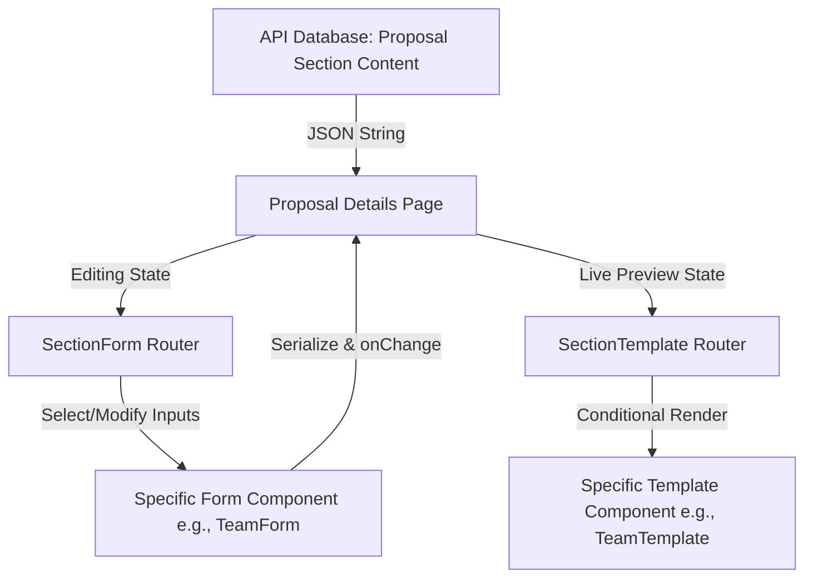

# Proposal Studio - Architectural Manual & Onboarding Guide

This document provides a comprehensive overview of the **Proposal Studio** system, its file conventions, and instructions on how to add or modify sections, templates, forms, and translations. It serves as a persistent context guide for future development.

---

## 🏗️ System Architecture & Data Flow

The Proposal Studio is a split-screen workspace where administrators edit proposal content on the left (Form) and see a preview on the right (Template) representing the output.



### 1. Serialized JSON Storage

Every section's content is stored in the database as a single serialized JSON string.

- If the content is uninitialized or null, the system uses default mock data defined in the utility files.
- Users can clear fields or delete items, which stores empty strings/empty arrays.
- A **Reset Section** button on the workspace header allows restoring a section back to its default uninitialized mock data by saving `""` (empty string) to the backend.

### 2. Conditional Rendering

If a user clears or deletes a text block, title, or card:

- The template code must perform a strict existence check: `(data.field || "").trim() !== ""` or check array lengths.
- If the field is empty, the corresponding element, section, or card is hidden dynamically.

---

## 📂 Core Files & Directories

### 🛠️ Data Parsers & Utility Layer

These files handle parsing the JSON content, providing default Arabic/English mock data, mapping API information (e.g. company profile details, past projects count, team members, etc.), and defining TypeScript interfaces:

- [proposal-utils.ts](file:///home/amr-mohamed27/trseah/poc/frontend/src/lib/proposal-utils.ts) — Main hub re-exporting all sub-modules.
- [cover-page.ts](file:///home/amr-mohamed27/trseah/poc/frontend/src/lib/proposal/cover-page.ts) — Parses metadata, stats, logos.
- [cover-letter.ts](file:///home/amr-mohamed27/trseah/poc/frontend/src/lib/proposal/cover-letter.ts) — Recipient details, subject, body, signature.
- [executive-summary.ts](file:///home/amr-mohamed27/trseah/poc/frontend/src/lib/proposal/executive-summary.ts) — Highlights, key stats, roadmap.
- [scope-understanding.ts](file:///home/amr-mohamed27/trseah/poc/frontend/src/lib/proposal/scope-understanding.ts) — Requirements, objectives, project goals.
- [vision-2030.ts](file:///home/amr-mohamed27/trseah/poc/frontend/src/lib/proposal/vision-2030.ts) — Strategic alignment, pillars.
- [company-profile.ts](file:///home/amr-mohamed27/trseah/poc/frontend/src/lib/proposal/company-profile.ts) — Numbers, values, certificates.
- [past-projects.ts](file:///home/amr-mohamed27/trseah/poc/frontend/src/lib/proposal/past-projects.ts) — Highlighted case studies, impact.
- [methodology.ts](file:///home/amr-mohamed27/trseah/poc/frontend/src/lib/proposal/methodology.ts) — Phased timeline, deliverables matrix.
- [team.ts](file:///home/amr-mohamed27/trseah/poc/frontend/src/lib/proposal/team.ts) — Leadership cards with Lucide icons dropdown, resource allocation table.

### 📝 Edit Forms

These components host the editing inputs, list management controls, and markdown text areas:

- [SectionForm.tsx](file:///home/amr-mohamed27/trseah/poc/frontend/src/components/proposal/SectionForm.tsx) — Main form router.
- [CoverPageForm.tsx](file:///home/amr-mohamed27/trseah/poc/frontend/src/components/proposal/CoverPageForm.tsx)
- [CoverLetterForm.tsx](file:///home/amr-mohamed27/trseah/poc/frontend/src/components/proposal/CoverLetterForm.tsx)
- [ExecutiveSummaryForm.tsx](file:///home/amr-mohamed27/trseah/poc/frontend/src/components/proposal/ExecutiveSummaryForm.tsx)
- [ScopeUnderstandingForm.tsx](file:///home/amr-mohamed27/trseah/poc/frontend/src/components/proposal/ScopeUnderstandingForm.tsx)
- [Vision2030Form.tsx](file:///home/amr-mohamed27/trseah/poc/frontend/src/components/proposal/Vision2030Form.tsx)
- [CompanyProfileForm.tsx](file:///home/amr-mohamed27/trseah/poc/frontend/src/components/proposal/CompanyProfileForm.tsx)
- [PastProjectsForm.tsx](file:///home/amr-mohamed27/trseah/poc/frontend/src/components/proposal/PastProjectsForm.tsx)
- [MethodologyForm.tsx](file:///home/amr-mohamed27/trseah/poc/frontend/src/components/proposal/MethodologyForm.tsx)
- [TeamForm.tsx](file:///home/amr-mohamed27/trseah/poc/frontend/src/components/proposal/TeamForm.tsx)

### 🎨 Visual Layout Templates

These render the styled A4-proportioned view blocks with consistent branding (Accent colors: dark green `#032e27`, vibrant light green `#00c595`):

- [SectionTemplate.tsx](file:///home/amr-mohamed27/trseah/poc/frontend/src/components/proposal/SectionTemplate.tsx) — Main template router.
- [CoverPageTemplate.tsx](file:///home/amr-mohamed27/trseah/poc/frontend/src/components/proposal/CoverPageTemplate.tsx)
- [CoverLetterTemplate.tsx](file:///home/amr-mohamed27/trseah/poc/frontend/src/components/proposal/CoverLetterTemplate.tsx)
- [ExecutiveSummaryTemplate.tsx](file:///home/amr-mohamed27/trseah/poc/frontend/src/components/proposal/ExecutiveSummaryTemplate.tsx)
- [ScopeUnderstandingTemplate.tsx](file:///home/amr-mohamed27/trseah/poc/frontend/src/components/proposal/ScopeUnderstandingTemplate.tsx)
- [Vision2030Template.tsx](file:///home/amr-mohamed27/trseah/poc/frontend/src/components/proposal/Vision2030Template.tsx)
- [CompanyProfileTemplate.tsx](file:///home/amr-mohamed27/trseah/poc/frontend/src/components/proposal/CompanyProfileTemplate.tsx)
- [PastProjectsTemplate.tsx](file:///home/amr-mohamed27/trseah/poc/frontend/src/components/proposal/PastProjectsTemplate.tsx)
- [MethodologyTemplate.tsx](file:///home/amr-mohamed27/trseah/poc/frontend/src/components/proposal/MethodologyTemplate.tsx)
- [TeamTemplate.tsx](file:///home/amr-mohamed27/trseah/poc/frontend/src/components/proposal/TeamTemplate.tsx)

### 🌐 Localization Catalogs

All forms, tooltips, placeholders, and icon names are localized:

- [en.json](file:///home/amr-mohamed27/trseah/poc/frontend/messages/en.json) (Under `AdminProposals.form`)
- [ar.json](file:///home/amr-mohamed27/trseah/poc/frontend/messages/ar.json) (Under `AdminProposals.form`)

---

## 🛠️ Step-by-Step: Adding a New Section

To add a brand-new proposal section (e.g. `financial_proposal`):

### Step 1: Create the Data Parser

Create `src/lib/proposal/financial.ts`:

```typescript
import { ProposalDto } from "../proposal-utils";

export interface FinancialData {
  title: string;
  totalCost: string;
  items: Array<{ description: string; price: number }>;
}

export function parseFinancialData(
  serialized: string | undefined,
  isRtl: boolean,
  proposalData?: ProposalDto | null,
): FinancialData {
  const tDefault = {
    title: isRtl ? "التكلفة المالية" : "Financial Cost",
    totalCost: "0.00",
    items: [],
  };

  if (!serialized) return tDefault;

  try {
    const parsed = JSON.parse(serialized);
    return {
      title: parsed.title || tDefault.title,
      totalCost: parsed.totalCost || tDefault.totalCost,
      items: parsed.items || tDefault.items,
    };
  } catch {
    return tDefault;
  }
}
```

### Step 2: Register in `proposal-utils.ts`

Add the following line to `src/lib/proposal-utils.ts`:

```typescript
export * from "./proposal/financial";
```

### Step 3: Create the Form Component

Create `src/components/proposal/FinancialForm.tsx` utilizing standard input designs, and trigger `onChange(JSON.stringify(updatedState))` on modification.

### Step 4: Create the Template Component

Create `src/components/proposal/FinancialTemplate.tsx`. Ensure all elements use existence checks to support dynamic deletion hiding.

### Step 5: Add Localized Strings

Add translation keys in `messages/en.json` and `messages/ar.json` inside the `AdminProposals` namespaces.

### Step 6: Register in Routers

1. **`SectionForm.tsx`**: Add check:
   ```typescript
   if (sectionId === "financial_proposal") {
     return <FinancialForm content={content} onChange={onChange} isRtl={isRtl} proposalData={proposalData} />;
   }
   ```
2. **`SectionTemplate.tsx`**: Add check:
   ```typescript
   if (sectionId === "financial_proposal") {
     return <FinancialTemplate content={content} isRtl={isRtl} proposalData={proposalData} />;
   }
   ```
3. **`src/app/[locale]/(dashboard)/admin/proposals/[id]/page.tsx`**: Update the conditional switch around line 820 to route the custom form rather than the generic markdown editor:
   ```typescript
   selectedSectionId === "financial_proposal" || ...
   ```

---

## 💡 Important Best Practices

- **TypeScript Safety**: Always run `pnpm type-check` after modifications.
- **RTL / Dir Layouts**: Use `style={{ direction: isRtl ? "rtl" : "ltr" }}` on wrappers to support clean bi-directional rendering.
- **No Hardcoded Names**: For corporate representation templates, avoid individual employee names unless explicitly supplied. Use functional role/title cards instead.
